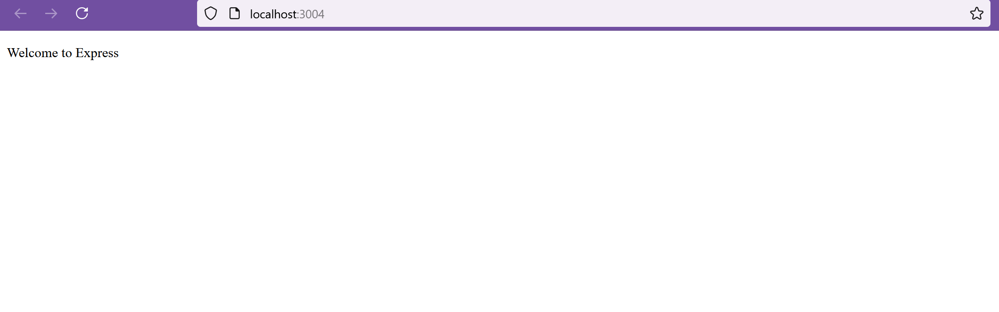

# Getting-started-with-Node-js-Express-and-EJS-templating
learn how to install the basic dependencies for the project, configure your Express app, create a request handler, and define an Embedded JavaScript (EJS) template

## mkdir foldername
## cd foldername
## npm init -y
## npm i express ejs
## code .
## node app.js
## npm start

